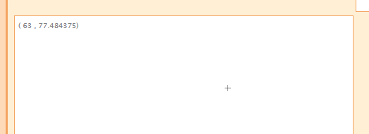

# Turn an LED on and off over the Internet
In this lab we will use the circuit from the previous lab and program the Arduino to turn the LED on and off, either using another computer or an Android smartphone. You will need a partner. One person will connect the Arduino to their computer. The other person will connect to it using either a computer or an Android smartphone.
### Step 1: Create a new program in Scratch for Arduino
### Step 2: Connect to your Scratch program from another computer
On your partners, open a browser and enter the URL: [http://s4a.cat/android/index.html](http://s4a.cat/android/index.html). You'll need to enter the IP address of the computer that is connected to the Arduino. Go back to the computer that is connected to the Arduino and choose *Edit | Host Mesh.* Click to accept any security warning message. The IP address should be displayed. Enter the IP address in the browser window and click *Connect*.     
    
Then, check the box labeled *remote pad*   
   
Click somewhere in the remote pad   
   
## Step 3: Write Scratch code on the computer connected to the Arduino
Drag a *slider sensor value* block to Scripts. Right click on the block and choose *Remote X*.   
   
Now write some code to test the connection
   

## Step 4: Click on the remote pad of the remote computer
Go back to the computer with the browser open and click somewhere in the remote pad.   
   
The output form the computer's Scratch code should match the X position where the remote pad was clicked.   

## Step 5: Write code to turn the LED on and off with the remote pad
You will need to add:
- 1 *forever loop* block from the *Control* tab
- 1 *if else* block from the *Control* tab
- 1 *digital 13 on* block from the *Motion* tab
- 1 *digital 13 off* block from the *Motion* tab
- 1 *> (greater than)* block from the *Operators* tab
   
You should now be able to turn the LED on and off from the remote computer using the remote pad 
