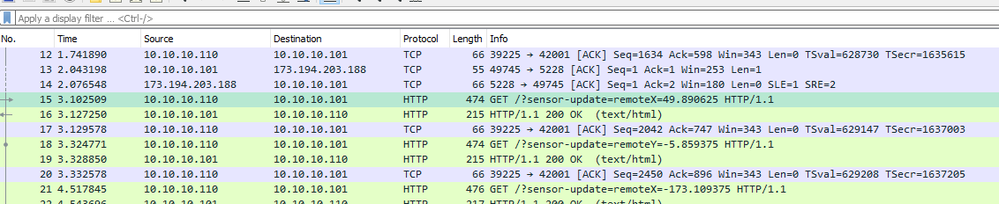

# Turn a LED on and off using an IP address
In this lab we will use the circuit from the previous lab. We will write a program that allows the LED from the previous lab to be turned on and off by another device (e.g. a computer or smartphone) over the network using an IP address. This is similar to way IoT devices work. (IoT is short for "Internet of Things.") For this lab it will be convenient to have a partner. One person can connect the Arduino to their computer. The other person will use a second computer or a smartphone to control it.
### Step 1: Create a new program in Scratch for Arduino and enable a remote network connection
Drag a *slider sensor value* block to Scripts. To enable a remote network connection choose *Edit | Host Mesh*.   
    
After choosing *Edit | Host Mesh* a pop up should appear that shows the computers IP address. Make a note of the IP address as we will need it later.   
   
### Step 2: Connect to your Scratch program from another computer
On your partners computer or smartphone, open a browser and enter the URL: [s4a.cat/android/](http://s4a.cat/android/index.html). (Note that the computer or smartphone will need to be connected to the schools SFUSD network either with an Ethernet cable or via Wifi. Trying to connect with the SFUSD guest network or over a cell phone network won't work.)   

You'll need to enter the IP address you made a note of, that is the IP address of the computer that is connected to the Arduino. Enter the IP address in the browser window and click *Connect*.   
   
Then, check the box labeled *Remote Pad*   
   
Click somewhere in the remote pad   
   

### Step 3: Configure Scratch to respond to the remote pad
In the pull down menu of the sensor block choose *remoteX*. (If *remoteX* doesn't appear in the pull down menu, make sure you have clicked in the remote pad of the other computer or smartphone to make the connection)  
   
  

### Step 4: Write code to turn the LED on and off with the remote pad
One way to do this might use the following blocks:
- 1 *forever loop* block from the *Control* tab
- 1 *if else* block from the *Control* tab
- 1 *digital 13 on* block from the *Motion* tab
- 1 *digital 13 off* block from the *Motion* tab
- 1 *> (greater than)* block from the *Operators* tab  

Snap the blocks together and arrange them so that there is a forever loop that checks to see if the `remoteX` is greater than zero. If it is, turn the LED on. Otherwise, turn it off. Make sure to click the blocks to run the program.
 

### Step 5: Click on the left and right of the remote pad
You should now be able to turn the LED on and off from the remote computer using the remote pad 

### Step 6: Capture some packets of communication
We can see the packets that are traveling across the Internet to control the Arduino. Start the wireshark program. While it is running, turn the LED on and off. You should see `HTTP ` `GET` packets that are being sent from remote pad to control the LED remotely. You should be able to see the X and Y coordinates in the data packets. You should also be able to see `HTTP` `OK` packets that acknoweldge that the the packets were received.                  

### Step 7: Submit the finished program
Have your teacher or a TA verify that you have a working program and have captured packets that were being used to control the Arduino remotely. Submit your finished program by uploading the `.sb` file to Google classroom. You should be able to find it in *My Documents | Scratch Projects*. If you worked with a partner, each partner should submit a copy of the finished program to Google classroom. 
