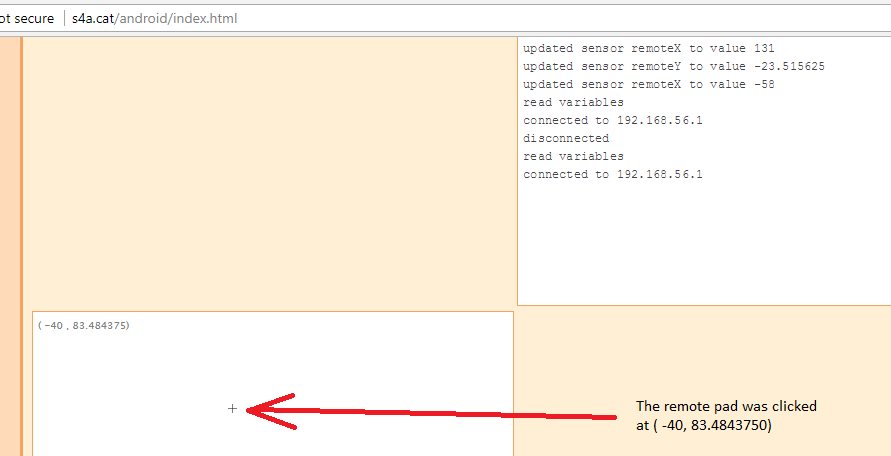

# Turn a LED on and off over the Internet
In this lab we will use the circuit from the previous lab. We will write a program that allows the LED to be turned on and off by another device (either a computer or smartphone) over the Internet. For this lab it will be convenient to have a partner. One person will connect the Arduino to their computer. The other person will connect to it using either a computer or a smartphone.
### Step 1: Create a new program in Scratch for Arduino
Drag a *slider sensor value* block to Scripts. Then choose *Edit | Host Mesh*. Agree to any security warnings. Make a note of the IP address of the computer that is connected to the Arduino.   
    
### Step 2: Connect to your Scratch program from another computer
On your partners computer or smartphone, open a browser and enter the URL: [http://s4a.cat/android/index.html](http://s4a.cat/android/index.html). You'll need to enter the IP address you made a note of, that is the IP address of the computer that is connected to the Arduino. Enter the IP address in the browser window and click *Connect*.   
   
Then, check the box labeled *remote pad*   
   
Click somewhere in the remote pad   
   
## Step 3: Configure Scratch to respond to the remote pad
In the pull down menu of the sensor block choose *remoteX*.   
   
  

## Step 4: Write code to turn the LED on and off with the remote pad
You will need to add:
- 1 *forever loop* block from the *Control* tab
- 1 *if else* block from the *Control* tab
- 1 *digital 13 on* block from the *Motion* tab
- 1 *digital 13 off* block from the *Motion* tab
- 1 *> (greater than)* block from the *Operators* tab   
Snap the blocks together as shown below. Click the blocks to run the program.
   

## Step 5: Click on the left and right of the remote pad
You should now be able to turn the LED on and off from the remote computer using the remote pad 

### Step 6: Submit the finished program
Have your teacher or a TA verify that you have a working program. Then, submit your finished program by uploading the `.sb` file to Google classroom. You should be able to find it in *My Documents | Scratch Projects* as shown below. If you worked with a partner, each partner should submit a copy of the finished program to Google classroom. 
